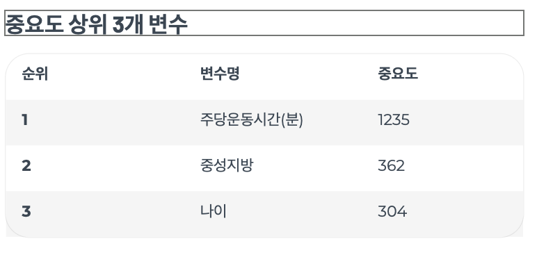

# kaggle_mini_project

# 🔗 배지 및 이모지 공식 소스 링크
| 용도 | 사이트 이름 | 링크 |
| :--- | :--- | :--- |
| **배지 생성** | Shields.io | [https://shields.io/](https://shields.io/) |
| **로고/색상 검색** | Simple Icons | [https://simpleicons.org/](https://simpleicons.org/) |
| **이모지 검색** | Emoji Cheat Sheet | [https://github.com/ikatyang/emoji-cheat-sheet](https://github.com/ikatyang/emoji-cheat-sheet) |

  
  
  
  

# 📖 프로젝트 주제 : 당뇨병 예측 모델링: 통계분석 및 머신러닝 접근
- 본 프로젝트는 대사 지표 및 생활 습관 데이터를 기반으로
당뇨병 발생 위험 요인을 통계적으로 규명하고, 이를 바탕으로 머신러닝 예측 모델을 구축·최적화하는 것을 목표로 한다.
- 단순 예측을 넘어, HbA1c와 혈당 지표 간의 관계를 중심으로 한 해석 가능한 인사이트 도출에 중점을 둔다.(Executive Summary)

## 1. Project Overview 
- **주제** : 대사 지표 및 생활 습관 변수를 활용한 당뇨병 유무 및 위험 단계 예측
- **데이터셋** : [Diabetes Health Indicators Dataset](https://www.kaggle.com/datasets/mohankrishnathalla/diabetes-health-indicators-dataset/data)
- **핵심 목표** : 
    - 회귀분석 및 분산분석을 통해 HbA1c의 주요 결정 요인 규명
    - 로지스틱 회귀 및 트리 기반 모델을 활용한 당뇨병 진단 예측
    - 변수 중요도 분석을 통한 고위험군 선별에 핵심적인 지표 도출
    - 통계 분석 결과와 머신러닝 성능을 상호 보완적으로 해석
- 프로젝트 기한 : 12/26 - 12/31

## 2. Data Dictionary (주요 핵심 변수)
- 실제 분석 결과를 통해서 확보한 변수들의 기재
- 총 변수갯수 : 31개

| 변수명 | 설명 | 값의 의미 |
| :--- | :--- | :--- |
| **Diabetes_binary** | 당뇨 여부 (**Target**) | 0: 음성, 1: 당뇨/전단계 |
| HighBP | 고혈압 여부 | 0: 정상, 1: 고혈압 |
| HighChol | 고콜레스테롤 여부 | 0: 정상, 1: 높음 |
| BMI | 체질량 지수 | 수치형 |
| Smoker | 흡연 여부 | 100개비 이상 흡연 여부 (0/1) |
| Stroke | 뇌졸중 경험 | 0: 없음, 1: 있음 |
| HeartDiseaseorAttack | 심장질환/심근경색 | 0: 없음, 1: 있음 |
| PhysActivity | 신체 활동 | 최근 30일 이내 운동 여부 (0/1) |
| GenHlth | 주관적 건강 상태 | 1(매우 좋음) ~ 5(매우 나쁨) |
| Age | 연령대 | 1(18-24) ~ 13(80세 이상) |
| Income | 소득 수준 | 1(최저) ~ 8(최고) |

## 3. Problem Definition
- **데이터 특성** : 
    - 본 데이터셋은 **혈당, HbA1c, 인슐린 등 유사한 대사 지표가 다수 포함**되어 있어 변수 간 상관성이 높고, 이로 인한 **다중공선성(multicollinearity)** 문제가 발생할 가능성이 있다.
    - 또한 당뇨병 유무를 기준으로 **클래스 불균형(class imbalance)** 이 존재하여, 단순 정확도 기반 모델은 소수 클래스(당뇨군)를 제대로 예측하지 못할 위험이 있다.
- **분석 방향**
    + 통계분석 : 다중회귀, 분산분석, 로지스틱회귀
    + 머신러닝 : 로지스틱회귀, 결정트리, XGBoost, LightGBM 

## 4. Data Preprocessing
- **클래스 불균형 해소** : Stratified Sampling(계층적 샘플링)을 활용한 학습/테스트 셋 비율 유지
- **범주형 변수 처리**
    + 순서형 : ordinal encoder 처리 (A, B, C)
    + 일반 범주 : One-Hot Encoding 처리
- **데이터 스케일링** : StandardScaler(표준화)

## 5. 통계분석 핵심 인사이트
- HbA1c는 나이나 BMI보다 식후혈당과 공복혈당에 의해 훨씬 강하게 설명되며, 혈당 변수를 통제하면 인구통계적 요인의 영향력은 유의하지 않다.

## 6. 모델링 평가지표
- 최종 모델은 LightGBM로 선정

| Model | Best CV AUC | Validation AUC |
| :--- | :---: | :---: |
| Logistic Regression | 0.693716 | 0.694032 |
| Decision Tree | 0.690813 | 0.691707 |
| XGBoost | 0.723869 | 0.723988 |
| LightGBM | 0.725150 | 0.725511 |
| **LightGBM (Reduced)** | **0.725150** | **0.725511** |

> **Note** : 최종 대회 결과는 Public 0.725511 / Private 0.725511 

## 7. Feature Importance (SHAP 기반)

- SHAP value를 활용하여 최종 머신러닝 모델의 변수 중요도 해석
- 모델 예측에 실제로 기여한 핵심 요인을 설명

### 중요 변수 Top 3
1. 주당 운동시간  
2. 중성지방  
3. 나이  

> 당뇨병 예측에서 나이보다  
> 생활습관과 대사 지표의 영향이 더 큼

## 8. Conclusion
- 모델 예측의 핵심 결정 요인 식별 : 분석 결과, [변수명 1, 예: 중성지방]과 [변수명 2, 예: 공복혈당]이 대사 질환 위험도를 예측하는 데 가장 결정적인 기여를 하는 것으로 나타났습니다.
- 지표별 위험도 기여 방향 및 비선형적 관계 확인 : 특정 지표(예: HDL-콜레스테롤)는 수치가 낮아질수록 위험도 기여도가 급격히 상승하는 비선형적 패턴을 보였습니다.
- 개인별 맞춤형 지표 관리의 근거 제시 : 동일한 예측 결과를 가진 대상자라도 SHAP Force Plot 분석 결과, 위험을 높이는 세부 요인은 각기 다름을 확인했습니다.

# 보고서
- 프로젝트 상세 보고서는 PDF 슬라이드 자료를 참고하여 주세요
- 대사 지표 간 연관성 분석 보고서 : [당뇨병 예측 모델링: 통계분석 및 머신러닝 접근](report/프로젝트분석보고서.pdf)
- 분석코드 : [분석코드](분석코드.ipynb)
- 분석코드 : [머신러닝코드](ml_pipeline.ipynb)

# 🔗 배지 및 이모지 공식 소스 링크
| 용도 | 사이트 이름 | 링크 |
| :--- | :--- | :--- |
| **배지 생성** | Shields.io | [https://shields.io/](https://shields.io/) |
| **로고/색상 검색** | Simple Icons | [https://simpleicons.org/](https://simpleicons.org/) |
| **이모지 검색** | Emoji Cheat Sheet | [https://github.com/ikatyang/emoji-cheat-sheet](https://github.com/ikatyang/emoji-cheat-sheet) |

