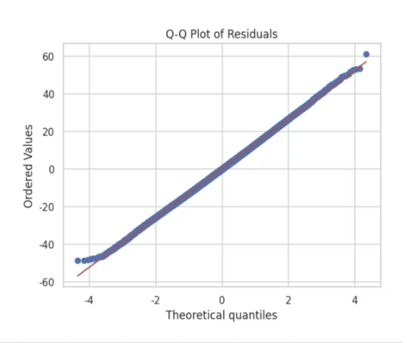

# kaggle_mini_project

# 🔗 배지 및 이모지 공식 소스 링크
| 용도 | 사이트 이름 | 링크 |
| :--- | :--- | :--- |
| **배지 생성** | Shields.io | [https://shields.io/](https://shields.io/) |
| **로고/색상 검색** | Simple Icons | [https://simpleicons.org/](https://simpleicons.org/) |
| **이모지 검색** | Emoji Cheat Sheet | [https://github.com/ikatyang/emoji-cheat-sheet](https://github.com/ikatyang/emoji-cheat-sheet) |

  
  
  
  

# 📖 프로젝트 주제 : 당뇨병 예측 모델링: 통계분석 및 머신러닝 접근
- 데이터틀 기반으로 생활 습관, 건강 지표 확인용... (프로젝트 전체 요약, executive summary)

## 1. Project Overview 
- **주제** : 생활 습관 또는 신체 상태를 활용한 당뇨병 유무 분류
- **데이터셋** : [Diabetes Health Indicators Dataset](https://www.kaggle.com/datasets/mohankrishnathalla/diabetes-health-indicators-dataset/data)
- **핵심 목표** : 설문지를 활용해서 **당뇨병 고위험군을 선별할 수 있는 예측 모델** 구축

## 2. Data Dictionary (주요 핵심 변수)
- 실제 분석 결과를 통해서 확보한 변수들의 기재
- 총 변수갯수 : 31개

| 변수명 | 설명 | 값의 의미 |
| :--- | :--- | :--- |
| **Diabetes_binary** | 당뇨 여부 (**Target**) | 0: 음성, 1: 당뇨/전단계 |
| HighBP | 고혈압 여부 | 0: 정상, 1: 고혈압 |
| HighChol | 고콜레스테롤 여부 | 0: 정상, 1: 높음 |
| BMI | 체질량 지수 | 수치형 |
| Smoker | 흡연 여부 | 100개비 이상 흡연 여부 (0/1) |
| Stroke | 뇌졸중 경험 | 0: 없음, 1: 있음 |
| HeartDiseaseorAttack | 심장질환/심근경색 | 0: 없음, 1: 있음 |
| PhysActivity | 신체 활동 | 최근 30일 이내 운동 여부 (0/1) |
| GenHlth | 주관적 건강 상태 | 1(매우 좋음) ~ 5(매우 나쁨) |
| Age | 연령대 | 1(18-24) ~ 13(80세 이상) |
| Income | 소득 수준 | 1(최저) ~ 8(최고) |

## 3. Problem Definition
- **데이터 특성** : blah
- **분석 방향**
    + 통계분석 : 다중회귀, 분산분석, 로지스틱회귀
    + 머신러닝 : 로지스틱회귀, 결정트리, XGBoost, LightGBM 

## 4. Data Preprocessing
- **클래스 불균형 해소** : blah
- **범주형 변수 처리**
    + 순서형 : ordinal encoder 처리 (A, B, C)
    + 일반 범주 : One-Hot Encoding 처리
- **데이터 스케일링** : StandardScaler(표준화)

## 5. 통계분석 핵심 인사이트
- 혈당이 중요함 : 다른 알려진 요인(나이, BMI)보다 통계적으로 매우 훨씬, 강력하게, 유의미하게 영향이 있음을 확인 (via 회귀분석)

## 6. 모델링 평가지표
- 최종 모델은 XGBoost로 선정

| Model | Accuracy | Recall | F1-Score | AUC-ROC |
| :--- | :--- | :--- | :--- | :--- |
| Random Forest | 0.85 | 0.70 | 0.74 | 0.88 |
| **XGBoost** | **0.86** | **0.75** | **0.78** | **0.91** |

> **Note** : 최종 대회 결과는 Public 0.70807 / Private 0.70807 (feat. 1등 점수). 

> **Note** : 최종 대회 결과는 Public 0.70807 / Private 0.70807 (상위 10%). 

## 7. Feature Importance (옵션)
- SHAP 활용
- 예측 모델에서 영향력이 가장 컸던 지표 순위
1. AGE
2. BMI
- 그림 추가

## 8. Conclusion
- 결론1
- 결론2
- 결론3

# 보고서
- 프로젝트 상세 보고서는 PDF 슬라이드 자료를 참고하여 주세요
- 00 보고서 : [당뇨병 예측 모델링: 통계분석 및 머신러닝 접근](report/프로젝트보고서.pdf)
- 분석코드 : [분석코드](분석코드.ipynb)

# 🔗 배지 및 이모지 공식 소스 링크
| 용도 | 사이트 이름 | 링크 |
| :--- | :--- | :--- |
| **배지 생성** | Shields.io | [https://shields.io/](https://shields.io/) |
| **로고/색상 검색** | Simple Icons | [https://simpleicons.org/](https://simpleicons.org/) |
| **이모지 검색** | Emoji Cheat Sheet | [https://github.com/ikatyang/emoji-cheat-sheet](https://github.com/ikatyang/emoji-cheat-sheet) |

